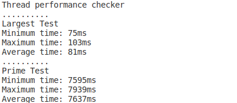
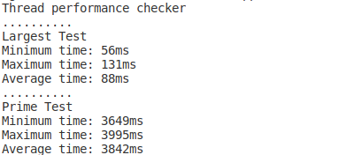
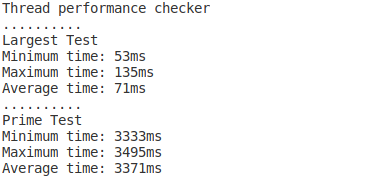
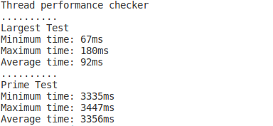

This repository holds an assignment for Operating Systems Lecture. Aim of the assignment was to deduce how multi threading reduces time requirements in linear sense. Project is shared for only reference purposes. No quarantines given for anything.

Tests are done on Intel i3-4005u 1.6Ghz CPU with 2 cores with multi threading.

Test set has 10 million elements with range of 0-5.000.000. Results shown below are collected over 10 tests.

Required test by assignment were find the largest integer and largest prime in the set.

Results for largest integer were flawed. They did not show any benefit from threading. Further tests showed that dominating force for the the test was iterating and CPU limits. 

Results for largest prime was more promising. When using 2 threading instead of one halving of runtime was expected. But further improvements were inhibited by CPU's capacity.

Checking if an integer is a prime is done by using "AKS primality check" algorithm. This algorithm can check if an integer of value 1 million is prime under 200 checks. This is crucial in test because as few of my classmates brute forced prime checking and their sets are exhausted after  10 minute mark.

##### Single Thread

##### Two Threads

##### Four Threads

##### Eight Threads

